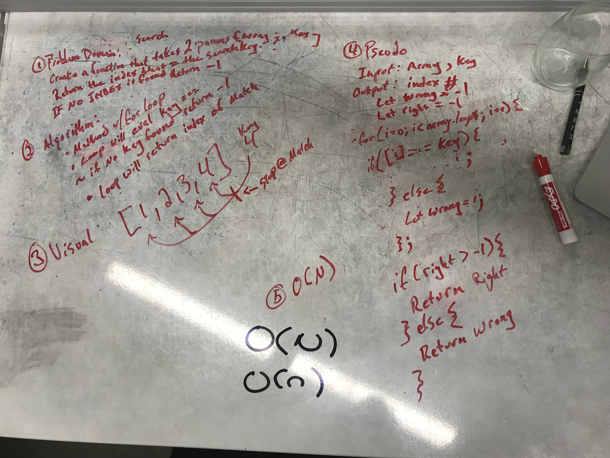

#binary-search

## Challenge
Create a function that takes in an Array and a search value.  Output the index of the search value.
If no search value is NOT found, the output shall be -1.  

## Solution

 - [x] Take a picture of Whiteboard
 - [x] make the README.md
 - [ ] make the .js file
 - [ ] make the test file