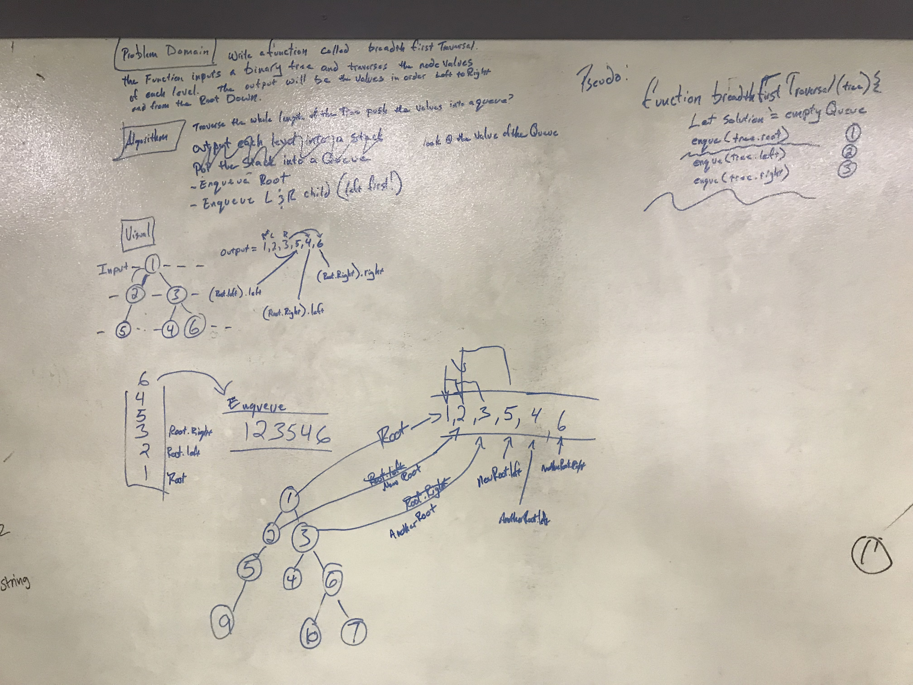

#breadthFirstTraversal

## Challenge
Write a function called breadthFirstTraversal.  The function inputs a binary tree and traverses 
the node values of each level.  The output will be the values in order Left to Right and from the
 root down.

## Solution

 - [x] Take a picture of Whiteboard
 - [x] make the README.md
 - [x] make the .js file
 - [x] make the test file
 - [ ] Test Code
 - [ ] Solution Code
 