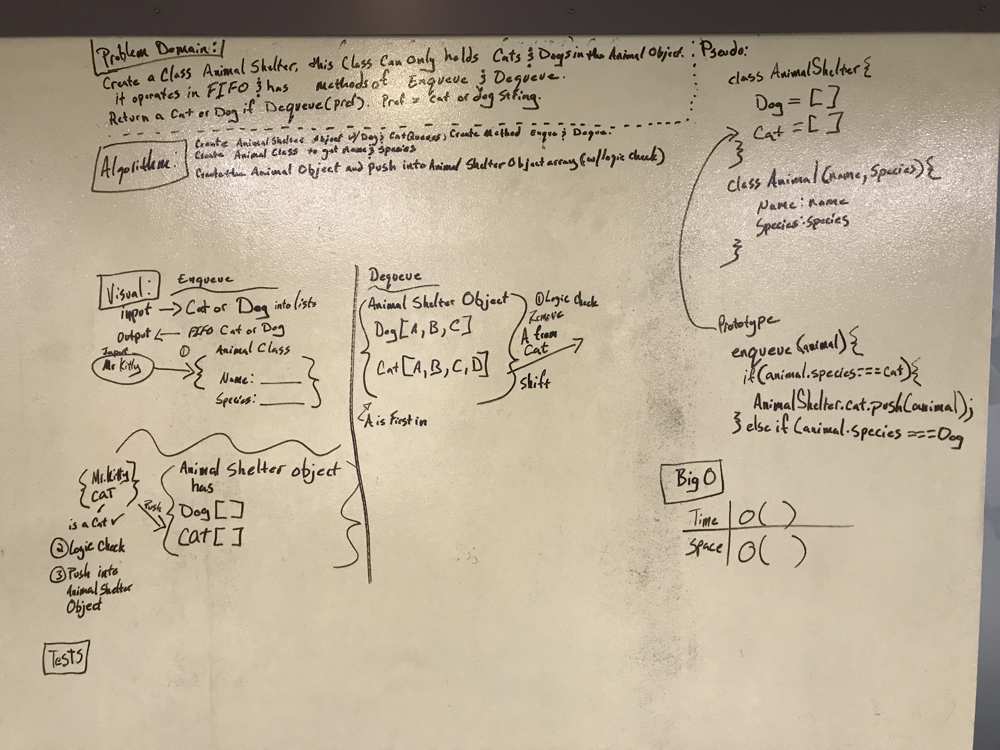

#FIFO ANIMAL SHELTER

## Challenge
Create a class Animal shelter that can only hold Cat & Dog Objects in a Queue.  
The Queue only operates in FIFO (First In First Out) and has the methods of
Enqueue and Dequeue.  The Dequeue output will be the oldest Dog or Cat.   

## Solution

 - [x] Take a picture of Whiteboard
 - [x] make the README.md
 - [x] make the .js file
 - [x] make the test file
 - [ ] Test Code
 - [ ] Solution Code