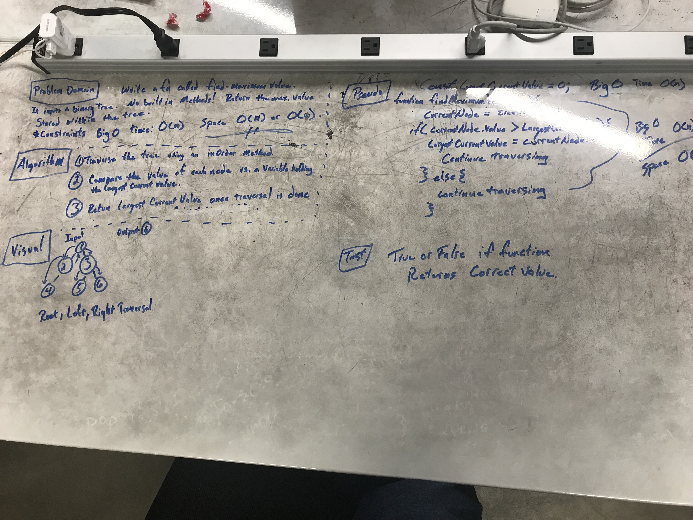

#Find Maximum value

## Challenge
Write a function called "find-maximum-value".  It inputs a binary tree.  
Return the maximum value stored within the tree.
*Constraints: big O time: O(n)  space: O(H) or O(w)

## Solution

 - [x] Take a picture of Whiteboard
 - [x] make the README.md
 - [x] make the .js file
 - [x] make the test file
 - [ ] Test Code
 - [ ] Solution Code
 