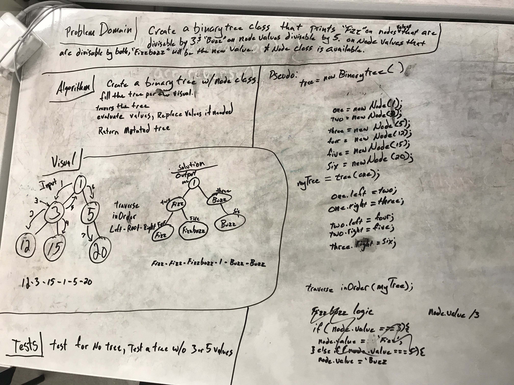

#Fizz Buzz Tree

## Challenge
  Create a binary tree class that returns a tree that replaces a node value that is divisable by 
  3 with "fizz" and any value that is divisable by 5 with "buzz".  If a value is divisable by both 3 
  & 5, then return "FizzBuzz"

## Solution

 - [x] Take a picture of Whiteboard
 - [x] make the README.md
 - [x] make the .js file
 - [x] make the test file
 - [ ] Test Code
 - [ ] Solution Code
 