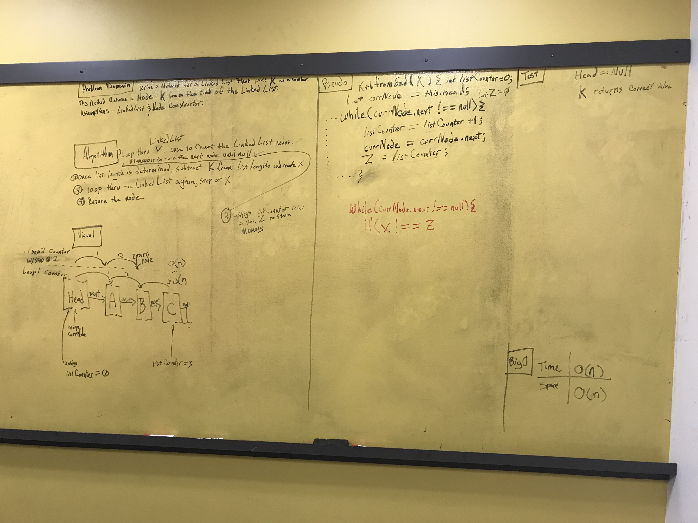

# Linked List - Kth from the End

## Challenge
Write a method for a Linked List that passes K as a number.  
This method returns a node from K positions from the end of the Linked List.
>assumptions: Linked List & Node Constructore already exist.

## Solution

 - [x] Take a picture of Whiteboard
 - [x] make the ReadME
 - [x] make the .js file
 - [x] make tests
 - [ ] post test
  