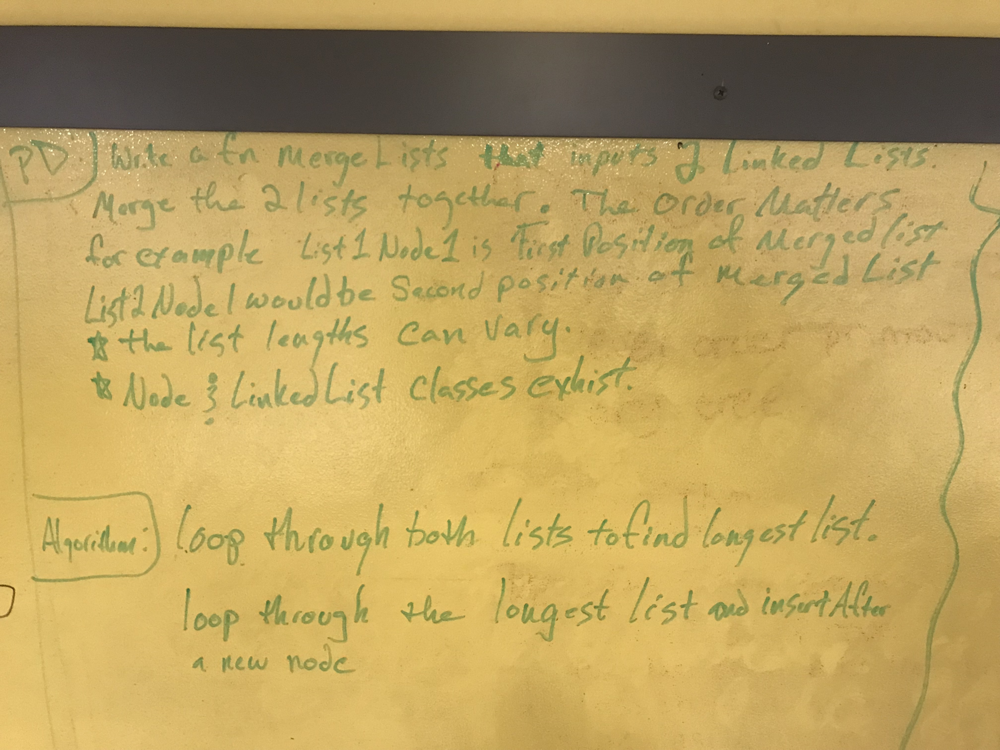
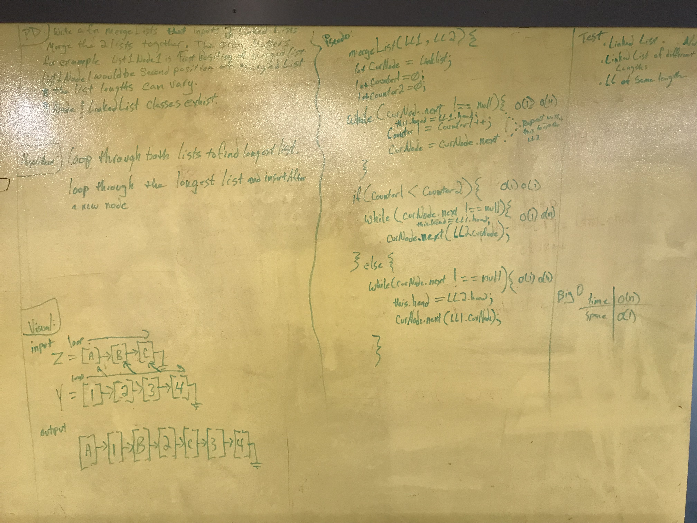
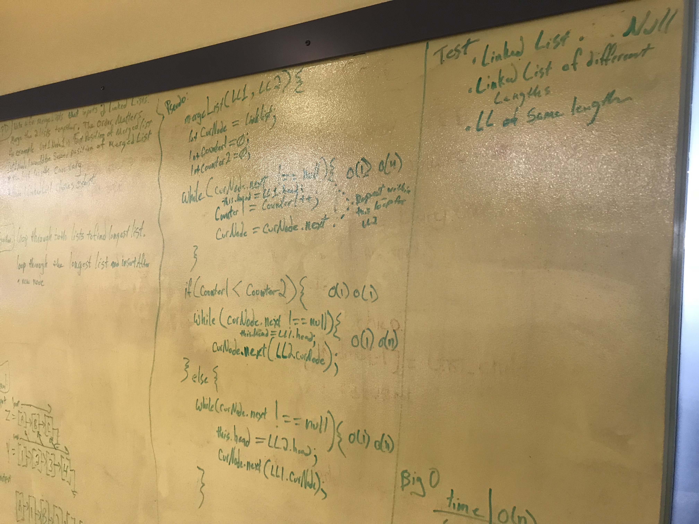

# Linked List Merge

## Challenge
Write a function mergeList that inputs 2 Linked Lists.
The order of the list matters.  The output should be List 1, Node 1 would be followed by 
List 2, Node 2 etc.  The list lengths can vary.  
>### Assumptions:
> - The Node & Linked Lists classes exist.
> - The previous Linked List Methods already exist.

## Solution

 - [x] Take a picture of Whiteboard
 - [x] make the README.md
 - [x] make the .js file
 - [x] make the test file
 - [ ] make test code for solution
 - [ ] make solution code