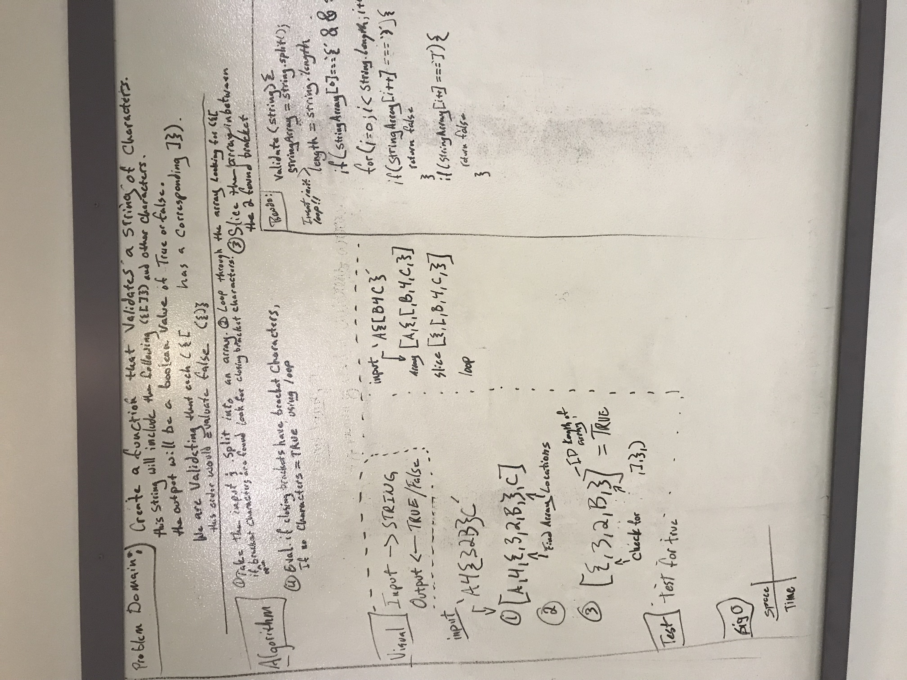

# Multi Bracket Validation

## Challenge
Create a function that validates a string of Characters.  This string will include the following:
{ ( [ ]) }
We are validating that each of the above opening brackets has a CORRESPONDING closing bracket.
If there is no corresponding closing bracket, then the function will evaluate with a FALSE boolean.
If the function evaluates the string has all corresponding brackets in correct order then the 
function will return a TRUE boolean value.

## Solution

 - [x] Take a picture of Whiteboard
 - [x] make the ReadME
 - [x] make the .js file
 - [ ] make tests
 - [ ] post test