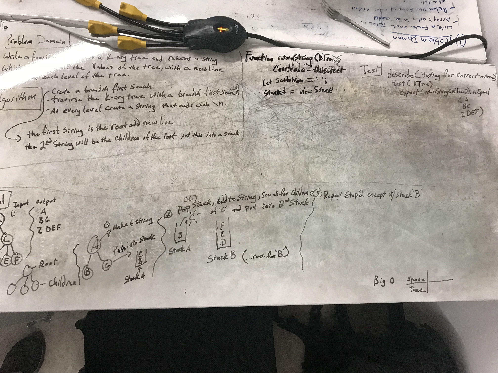

# Print Level Order
## Challenge
Write a function based on the specifications above, which takes in a k-ary tree. Without utilizing any of the built-in methods available to your language, return a string that contains a listing of all values in the tree, with new lines in-between each level of the tree.   
>### Assumptions:
> - You have access

## Solution

 - [x] Take a picture of Whiteboard
 - [x] make the README.md
 - [x] make the .js file
 - [x] make the test file
 - [ ] make test code for solution
 - [ ] make solution code