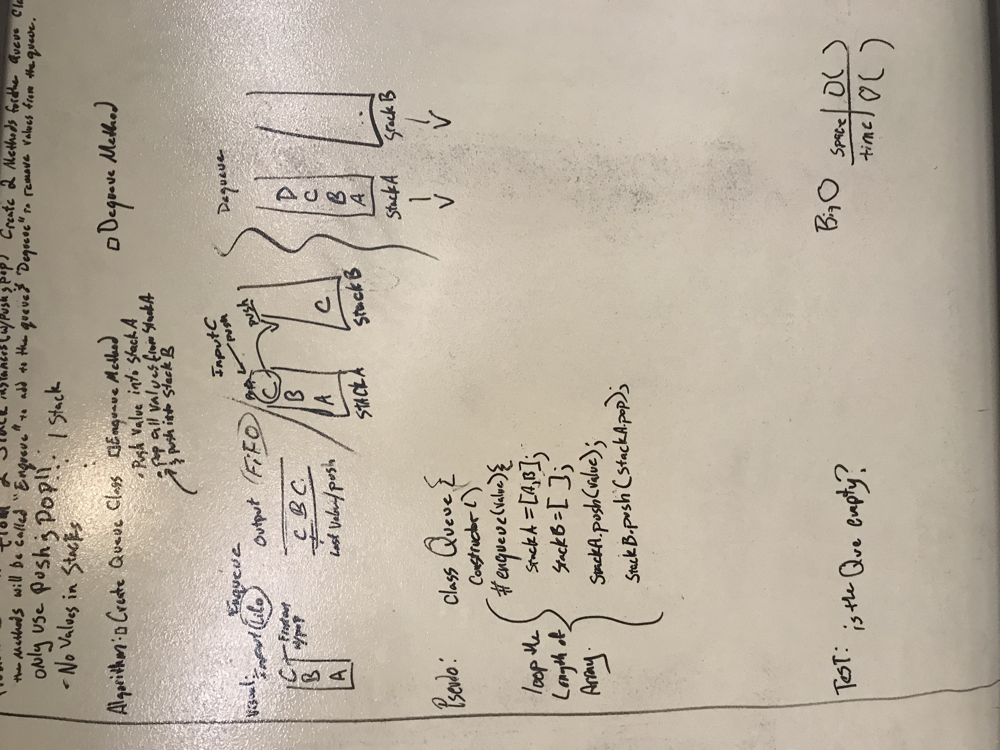

# Queue with Stacks
## Challenge
From 2 Stacks classes, create a Queue class that has the methods Enqueue and Dequeue.
The     
>### Assumptions:
> - You can only use push and pop from the stacks class

## Solution

 - [x] Take a picture of Whiteboard
 - [x] make the README.md
 - [x] make the .js file
 - [x] make the test file
 - [ ] make test code for solution
 - [ ] make solution code