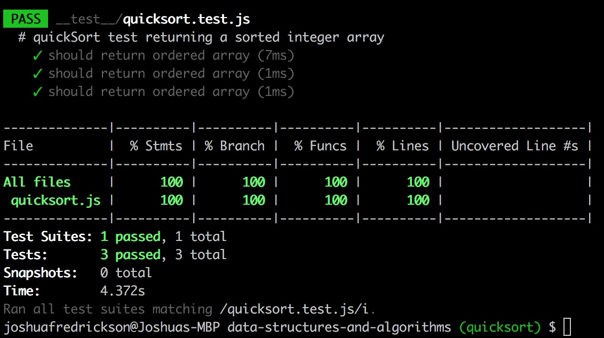

# Quick Sort

## Challenge
Write a function that accepts an array of integers, 
and returns an array sorted by a recursive quicksort algorithm.

## Solution

 - [x] Take a picture of Whiteboard
 - [x] make the README.md
 - [x] make the .js file
 - [x] make the test file
 
 - [x] Test Code
 - [x] Solution Code