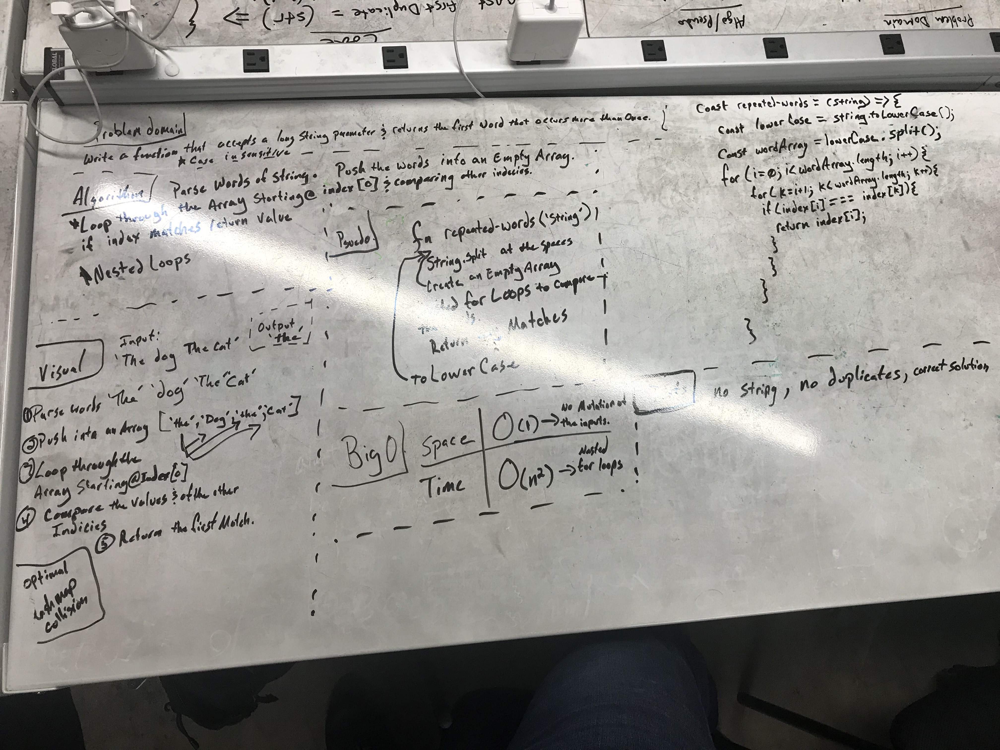

# Repeated Word

## Challenge
Write a function that accepts a lengthy string parameter and return the first word to occur more 
than once in that provided string.
>### Assumptions:
> - You have access to ALL builtin methods

## Solution

 - [x] Take a picture of Whiteboard
 - [x] make the README.md
 - [x] make the .js file
 - [x] make the test file
 - [ ] make test code for solution
 - [ ] make solution code