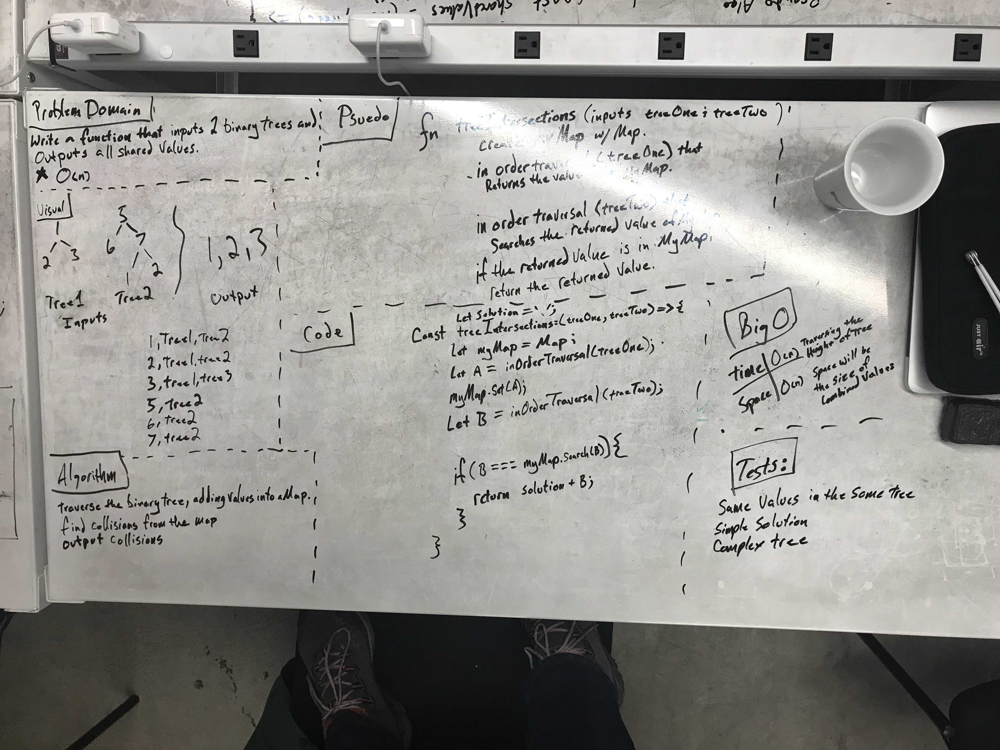

# TREE INTERSECTION

## Challenge

Write a function called treeIntersection that takes two binary tree parameters and return a set 
of values found in both trees.

## Solution

 - [x] Take a picture of Whiteboard
 - [x] make the ReadME
 - [x] make test file .js file
 - [x] make .js file
 - [ ] pass tests
 